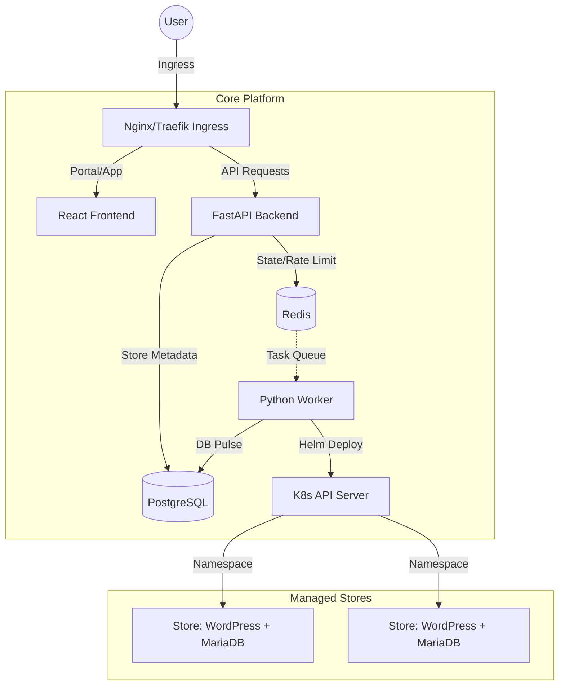

# Store Provisioning Platform 🚀

A scalable, secure, and automated platform for provisioning WordPress/WooCommerce stores on Kubernetes.

## 🚀 Live Demo

<a href="https://drive.google.com/file/d/1fcsj416yatA_h9i1hcxkr_KurmBS9-ct/view?usp=drive_link" target="_blank">
  
</a>

## 🏗️ Architecture

The platform follows a microservices architecture designed for high availability and security.



## ✨ Key Features

### 1. Multi-Layer Security
- **Nginx Ingress Level**: Rate limiting at the edge (100 RPM) to prevent bot abuse and DDoS.
- **Backend Level**: Business-logic rate limiting (2 stores per hour per IP) using a **Redis Sliding Window** for precise enforcement.
- **Secret Management**: No hardcoded credentials. All sensitive data (DB passwords, API keys) are managed via **Kubernetes Secrets** and injected as environment variables.

### 2. Scalability & Resilience
- **Auto-Scaling**: Horizontal Pod Autoscalers (HPA) automatically scale the Backend and Worker based on CPU utilization.
- **Resource Management**: Each component has defined CPU/Memory requests and limits to ensure cluster stability.
- **Stateful Management**: Postgres and Redis are deployed as **StatefulSets** with Persistent Volume Claims (PVC).

### 3. Automated Provisioning
- **Worker Pattern**: Asynchronous store creation using a Redis task queue.
- **Helm Integration**: The worker dynamically executes Helm commands to provision fresh Bitnami WordPress environments in dedicated namespaces.

---

## 🚀 Setup & Deployment

### Prerequisites
- Kubernetes Cluster (k3s, minikube, or EKS/GKE)
- Helm 3.x
- `kubectl` configured

### 1. Installation via OCI (Recommended)
You can install the platform directly from the public OCI registry without cloning the repository:

```bash
# Set your public IP (for nip.io hostnames)
export PUBLIC_IP="your.server.ip"

helm install store-platform oci://registry-1.docker.io/ayushakr38/store-platform \
  --version 0.1.3 \
  -n store-platform --create-namespace \
  --set publicIp=$PUBLIC_IP
```

### 2. Installation from Source
```bash
git clone https://github.com/your-repo/urumi-assignment.git
cd urumi-assignment

helm install store-platform ./charts/store-platform \
  -n store-platform --create-namespace \
  --set publicIp=your.server.ip
```

## 🛠️ Configuration

| Value | Description | Default |
|-------|-------------|---------|
| `publicIp` | Your server's public IP for DNS | `127.0.0.1` |
| `ingress.className` | Ingress controller (traefik/nginx) | `traefik` |
| `secrets.postgresPassword` | Database password | `password123` |
| `backend.replicaCount` | Initial backend instances | `1` |
| `worker.resources.limits.memory` | Worker RAM (OOM protection) | `1Gi` |

---

## 🔗 Access Points
- **Portal**: `http://platform.<IP>.nip.io`
- **Frontend App**: `http://app.<IP>.nip.io`
- **Backend API**: `http://api.<IP>.nip.io`
